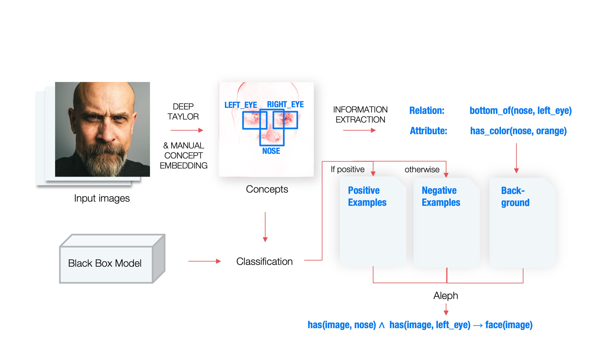
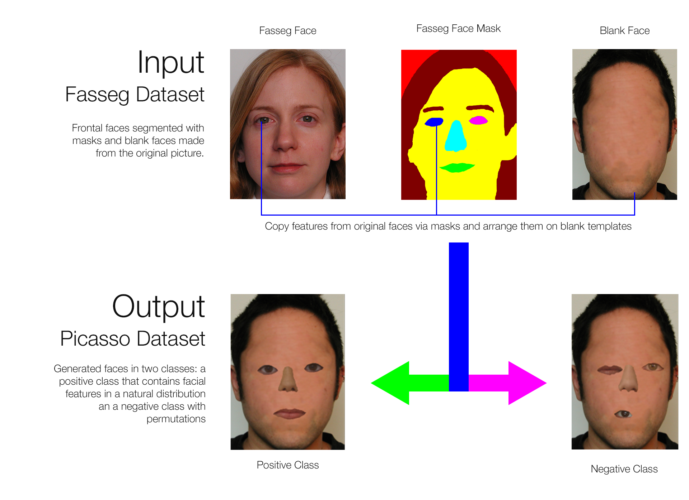
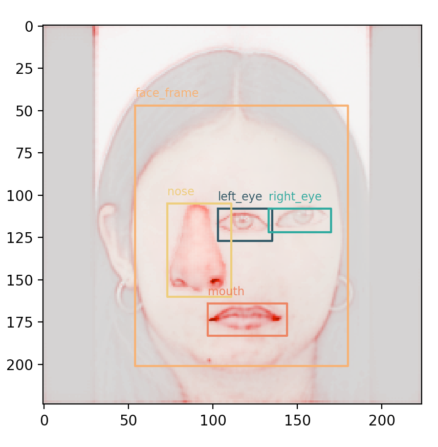

# Explaining DNNs using ILP with knowledge derived from Deep Taylor Heatmaps



## Install
### Requirements
This project needs Python 3.6. Then install the dependencies:
```bash
pip install -r requirements.txt
```


## Usage
Run all files from the src folder.

### 0. Data Generation

1. Generate the picasso dataset using [this repository](https://github.com/mc-lovin-mlem/concept-embeddings-and-ilp). Note: For the fasseg face masks the right eye has to be colorized magenta and you will need to create blank faces from the original fasseg images.
2. Place the generate images in `./src/datasets`. You will need 3 folders: train, val and test. The picasso generator only creates two of these folders, so split the test folder oder let the generator run twice.

### 1. Training the model
Run:
`python3 train.py`

This will finetune a vgg16 model to the picasso dataset.

#### Arguments
* `epochs`: The number of epochs to train for
* `base_layers`: The number of, e.g. 0 (default) will only train the head
of the model (the output layers). This is strongly recommended for warming up
the model during at least the first epoch of training.

#### Outputs
* Checkpoints during training in `./src/checkpoints`
* Training logs for TensorBoard in `./src/logs/fit%year%%month%%day%-%time%/`
* Trained keras model in `./src/output/model/vgg.model`


#### TensorBoard
The trainer has a TensorBoard callback attached, you can view the TensorBoard
by starting the TensorBoard from the root of this project with the path to the log files:

```console
$ tensorboard --logdir src/logs
```

You might try giving the absolute path if this does not work.

### 2. Sampling data and creating heatmaps
1. Sample training data running `python3 generate_heatmaps.py`. This will let the model
classify all of the test images, and then select those n images per class
that are closest to the descion boundary of the model. Those images
will be copied to ilp images.

#### Arguments
* `n`: The number of images to select per class
* `only_correct`: If true, this will include only correctly classified images
in the pos / neg folders

#### Outputs
4 folders containing the selected images in `./src/output/ilp/images`:
* pos (all images classified as positive)
* neg (all images classified as negative)
* fp (all false positives in the classification)
* fn (all false negatives in the classification)


* 1 pickle file: `./src/output/ilp/pickles/df.p`. It contains information on all
selected images:


| filename  |   ground_truth  |   prediction  |   predicted_class |
|-----------|-----------------|---------------|-------------------|
|the file referenced|the true label for this file|the predicted value of the output layer|class calculated from the prediction|
|pos_01.png |1                |0.812          |1                  |
|pos_02.png |1                |0.49           |0                  |


### 3. Intermediate step: Manually create annotations
1. For all generated heatmaps you will need to create annotations for the
objects you can see on the image, this includes a bounding box and an associated
class name in the VOC-Format. I used [ybat](https://github.com/drainingsun/ybat).
Note: Only use two folder: pos and neg or fp and fn. Delete or move the other folders.
Pos and neg will most likely already include all of the fp and fn files, unless
the model outputs more fp/fn then images selected for output via the -n factor.
Basically choose pos/neg folders unless you want to induce a theory explicitly
for false positives and false negatives.
2. Place the annotations in `.src/output/annotations`


### 4. Generate samples
Run:
`python3 generate_samples.py`

This will parse the annotations, link them with the selected images and the
model output stored in `df.p` and generate Feature-Objects that store all the
information gathered.



Note: There is a offset in this image because the annotations were not generated
correctly.

### Parameters
* show_img: Plot the objects (not implemented yet)

#### Outputs
* 1 pickle file `./src/output/ilp/pickles/samples.p`, the List of Feature-Objects.


### 5. Create background knowledge for Aleph
Run:
`python3 generate_aleph.py`

This will create the background knowledge files for aleph, calculation predicates using the stored
samples.

#### Outputs
3 files in `./src/output/ilp/aleph`:
* picasso.b - Background Knowledge (modes and determinations)
* picasso.f - Predicates for positive examples
* picasso.n - Predicates for negative examples


### 6. Induce the theory with Aleph
https://www.cs.ox.ac.uk/activities/programinduction/Aleph/aleph.html
1. Load Aleph: Place the aleph executable in the same path as the outputs from
the previous step. Then start the prolog interpreter and load aleph `[aleph].`
2. Read files: `read_all(picasso).`
3. Induce the theorey `induce.`

I use SWI-Prolog with this port of alpeh:
https://github.com/friguzzi/alephhttps://github.com/friguzzi/aleph

### 7. Test the theory learnt by Aleph
Aleph will generate an hypothesis that will look like this:

```
face(A) :-
has_a(A,C), is_a(C,nose), top_of(C,D)
```

This is a first order logic horn clause in implication form and all
literals are connected via conjunctions. For the implication to be true,
all literals need to be trued. That means, if only one predicate is negated,
this clause should evaluate to false. By following this logic,
we can test each predicate in isolation and check if the correlation learnt
with the hypothesis is actual causation.
In order to do that, we create datasets, were strictly only one predicate
of the hypothesis is violated. We then test, if the CNN predicts them to be negative.
If positive predictions go above a certain threshold, causation seems unlikely
and the hypothesis describes only correlation.


#### Inputs
For each predicate, generate a dataset that violates only this
predicate but otherwise shows a "natural" face [with this tool](https://github.com/lthamm/picasso_generator).
Copy the images to the path defined in `config["predicates_picasso"]`

Run:
`python3 evaluate_hypothesis.py`


## Known issues

### Keras
keras 2.2.4 has a bug when loading a model with specified input layer


### Intel(R) MKL Optimizations
On macOS with a conda environment using e.g. pandas might result in:
`Error #15: Initializing libiomp5.dylib, but found libiomp5.dylib already
initialized OMP`
This is because of condas MKL Optimizations. With the macOS Accelerate Framework
this leads to OpenMP (OMP) being intialized twice.


Fix: Deactivate MKL for conda.
`conda install nomkl`
* https://docs.anaconda.com/mkl-optimizations/
* https://stackoverflow.com/a/58869103/8766814


## Sources

### Original authors
* Rabold, J., Deininger, H., Siebers, M., Schmid, U., 2019. Enriching Visual with Verbal Ex- planations for Relational Concepts -- Combining LIME with Aleph. ArXiv191001837 Cs Stat.
* Rabold, J., Schwalbe, G., Schmid, U., 2020. Expressive Explanations of DNNs by Com- bining Concept Analysis with ILP, in: Schmid, U., Klügl, F., Wolter, D. (Eds.), KI 2020: Advances in Artificial Intelligence, Lecture Notes in Computer Science. Springer Interna- tional Publishing, Cham, pp. 148–162. https://doi.org/10.1007/978-3-030-58285-2_11

### Heatmapping
* Alber, M., Lapuschkin, S., Seegerer, P., Hägele, M., Schütt, K. T., Montavon, G., Samek, W., Müller, K. R., Dähne, S., & Kindermans, P. J. (2019). INNvestigate neural networks! Journal of Machine Learning Research, 20.](https://jmlr.org/papers/v20/18-540.html)

### Transfer learning
* https://keras.io/guides/transfer_learning/
* https://keras.io/api/applications/


For the full list of references, see the thesis. 
